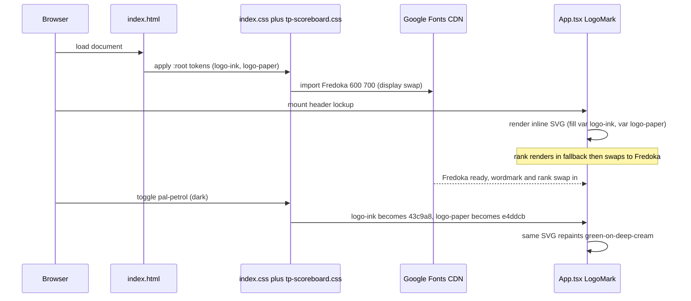

# Technical spec: Brand logo — fanned deck (Option 1)

Authoritative inputs: `user-story.md` (incl. **Addendum — Phase 3 clarifying
decisions**, which overrides earlier text and `design-spec.md` §5/§7),
`design-spec.md` (tokens, dark-mode, sizing, a11y), `handoff/README.md`
(exact geometry — reproduced verbatim below), `handoff/logos.jsx` (prototype).

Where the Addendum and the design-spec conflict, the **Addendum wins**:
- Fonts: Google `@import` (A1), NOT self-hosted woff2.
- Favicon: SVG-only (A2), NO raster fallback.
- PWA tile: pre-generated committed PNGs (A3), NO build step / image dep.

---

## 1. Overview

Replace the placeholder branding (four-10s `header-icon.svg`, dark 2×2-grid
`favicon.svg`, Inter `<h1>`) with the official Option-1 fanned-deck mark across
four touchpoints: header lockup, landing hero, browser-tab favicon, and PWA
home-screen tile. The mark is a single token-driven inline-SVG React component
reused in header + hero; it adapts light/dark via two CSS custom properties
(`--logo-ink`, `--logo-paper`). Favicon and PWA tile are static assets with
hardcoded brand hex (browser/OS chrome can't read app CSS vars). Fredoka 600/700
joins the existing Google Fonts `@import`. No backend, no data-model, no API
changes.

---

## 2. Affected components

| Area | Path | Change |
|---|---|---|
| Logo components (new) | `client/src/components/logo/` | New folder: `LogoMark.tsx`, `LogoTile.tsx`, `LogoLockup.tsx`, `logo.constants.ts` |
| Header | `client/src/App.tsx` | Swap ``+`<h1>` for `<LogoMark>` + Fredoka `<h1>`; drop `headerIcon` import |
| Landing hero | `client/src/pages/LandingPage.tsx` | Add `.landing-hero` block with `<LogoLockup>` above first `.card` |
| Global CSS | `client/src/index.css` | New `--logo-ink`/`--logo-paper` on `:root`; header `<h1>` Fredoka; `.landing-hero`; 480px responsive |
| Theme CSS | `client/src/styles/tp-scoreboard.css` | Extend `@import` URL with Fredoka 600;700; `--logo-ink`/`--logo-paper` overrides on `.pal-petrol` |
| Favicon | `client/public/favicon.svg` | Replace with icon-only green-on-cream mark (hardcoded hex) |
| PWA manifest (new) | `client/public/manifest.webmanifest` | New file |
| PWA icons (new) | `client/public/icons/` | New: `icon-192.png`, `icon-512.png`, `icon-maskable-512.png` (committed static PNGs) |
| HTML | `client/index.html` | Add `<link rel="manifest">` + PWA meta tags |
| Old asset (remove) | `client/src/assets/header-icon.svg` | Delete after `App.tsx` no longer imports it |

No data-model, API contract, migration, or external runtime dependency changes.
The only external dependency is the existing Google Fonts CDN (`@import`), to
which Fredoka is added (A4 — Space/Hanken Grotesk import stays).

---

## 3. Component architecture

New folder `client/src/components/logo/`. Per eslint
`react-refresh/only-export-components`, `.tsx` files export **only** components;
all constants/types live in `logo.constants.ts`.

### 3.1 `logo.constants.ts`

Exports shared geometry + brand constants so `LogoMark`, `LogoTile`, and the
favicon/PNG generation route never drift. Concrete values (do not paraphrase —
these are the authoritative handoff numbers):

```ts
// Brand hex — used ONLY where CSS vars can't reach (favicon SVG, LogoTile for
// PNG generation). In-app LogoMark uses var(--logo-ink)/var(--logo-paper).
export const BRAND_INK = "#206848";   // deep casino green
export const BRAND_PAPER = "#F0EADD"; // warm cream

// Option-1 fanned-deck geometry (viewBox 0 0 240 250)
export const MARK_VIEWBOX = "0 0 240 250";
export const MARK_ASPECT = 250 / 240;          // height = width * this
export const CARD = { w: 96, h: 134, rx: 12, sw: 8 } as const; // 5:7 card
export const CARD_CENTER = { cx: 120, cy: 120 } as const;
export const FAN_PIVOT = { x: 120, y: 205 } as const;
export const FAN_ANGLE = 17;                    // back-card splay, degrees
// front-card face coordinates
export const RANK = { x: 100, y: 85, fontSize: 31.7, weight: 700 };
export const CORNER_SUIT = { x: 100, y: 111, fontSize: 22 };
export const CENTER_PIP = { x: 120, y: 156, fontSize: 66 };

export const FONT_RANK = '"Fredoka", system-ui, sans-serif';
export const FONT_SUIT = "Georgia, 'Times New Roman', serif";

export const DEFAULT_RANK = "10";
```

> Rect math: `x = cx - 48`, `y = cy - 67` (i.e. `cx - w/2`, `cy - h/2`).
> Back cards `<g transform="rotate(±17 120 205)">`. Front card `rotate(0)`.

### 3.2 `LogoMark.tsx` (header + hero + favicon source)

Inline-SVG fanned deck. Ink/paper come from **CSS variables**, not props, so the
mark themes automatically under `.pal-petrol`.

Prop contract:

```ts
interface LogoMarkProps {
  size: number;              // rendered HEIGHT in px (width = size / MARK_ASPECT)
  rank?: string;             // default "10"; only "10" ships (override allowed)
  decorative?: boolean;      // default false
  className?: string;        // so callers attach hooks (e.g. "header-icon")
  title?: string;            // a11y label when not decorative; default "Toepify"
}
```

Sizing rule (note `size` is HEIGHT, mark is taller than wide):
`width = size / MARK_ASPECT`, `height = size`. (`MARK_ASPECT = 250/240`, so a
36px-tall mark is ~34.6px wide — matches design-spec §3.)

Fills/strokes:
- `rect fill="var(--logo-paper)" stroke="var(--logo-ink)" stroke-width="8"
  stroke-linejoin="round" rx="12" ry="12"`.
- All `<text>` (rank, corner suit, centre pip) `fill="var(--logo-ink)"`.
- Rank `<text>`: `font-family={FONT_RANK}` weight 700, `text-anchor="middle"`,
  `x=100 y=85 font-size=31.7`.
- Corner suit `<text>` `♠`: `font-family={FONT_SUIT}`, `x=100 y=111 font-size=22`.
- Centre pip `<text>` `♠`: `font-family={FONT_SUIT}`, `x=120 y=156 font-size=66`.

Accessibility (design-spec §8):
- `decorative` true → `aria-hidden="true"`, no role/label. **Use in the lockup**
  (header + hero) where the `<h1>` "toepify" already names the brand — avoids the
  SR double-announce "Toepify deck, toepify".
- `decorative` false → `role="img"` + `aria-label={title}` (default "Toepify").

> The `<text>` rank renders in the system fallback during Fredoka swap. It is
> `text-anchor="middle"` centred at `x=100`, so a metrics swap keeps it centred
> in the corner — it won't drift outside the card. (Edge case from §7 — safe by
> construction, flag for visual QA at swap.)

### 3.3 `LogoTile.tsx` (Option 3 — PWA-icon source only)

The inverted tile mark from `logos.jsx:103` (`LogoTile`). Rendered **only** for
PNG generation (section 9), never mounted in the running app. Hardcoded brand hex
(`BRAND_INK`/`BRAND_PAPER`) — the OS renders the home-screen icon outside the app
and cannot read theme vars (design-spec §6).

Geometry (verbatim from prototype, viewBox `0 0 220 220`):
- Tile: `rect x=0 y=0 w=220 h=220 rx=46 ry=46 fill={BRAND_INK}`.
- Back card: `cx=132 cy=96 rot=+20 w=116 h=164`, `fill=BRAND_PAPER
  stroke=BRAND_INK sw=5 radius=12`, no index (`backRank` null).
- Front card: `cx=92 cy=122 rot=-8 w=116 h=164`, same fills; corner index at
  `x=63 y=86` (`rankScale 1.3` → rank font-size `26 * 1.3 = 33.8`, corner suit
  font-size 22); centre pip `♠` at `x=92 y=168 font-size=80`.

Props: `size` (px square), `rank?` (default "10"). No `decorative`/theme props —
it is always the canonical colourway.

> Rect math for the 116×164 tile cards: `x = cx - 58`, `y = cy - 82`.

### 3.4 Wordmark — NOT a component, plain styled text

Per design-spec §3, the wordmark stays a real HTML text node, NOT baked into SVG
and NOT an SVG component:
- **Header**: the existing `<h1>toepify</h1>` (keeps the page's semantic `<h1>`
  and the `{isStaging && <span className="staging-label">}` child working —
  App.tsx:144-147). Restyled to Fredoka 600 via `.app-header h1` (section 5).
- **Hero**: a `<span className="landing-hero-wordmark">toepify</span>` inside
  `LogoLockup` (the hero is below the global header, which already owns the
  page `<h1>`; the hero wordmark is decorative brand, use a `<span>`).

No standalone `Wordmark.tsx` — it would be a one-line styled span with no logic,
and the header instance must remain the literal `<h1>` for staging/semantics.
Styling lives in CSS, not inline (project uses plain CSS).

### 3.5 `LogoLockup.tsx` (hero only)

Composes `<LogoMark decorative />` + the wordmark `<span>` for the landing hero.
Header does NOT use `LogoLockup` (its wordmark must stay the `<h1>` with the
staging span, which the lockup can't own). So:
- Header lockup = `App.tsx` JSX (LogoMark + `<h1>`), styled by `.header-link`.
- Hero lockup = `LogoLockup` (LogoMark + `<span>`), styled by `.landing-hero`.

Prop contract:

```ts
interface LogoLockupProps {
  iconSize: number;          // px height passed to LogoMark
  className?: string;        // default applied by caller (e.g. "landing-hero")
}
```

`LogoLockup` renders the icon `decorative` (the wordmark text carries the SR
name). Gap/font-size are CSS-driven via the `className`, not inline props, so
responsive rules in CSS can override at 480px.

---

## 4. CSS token changes — exact

### 4.1 `client/src/styles/tp-scoreboard.css` line 1 — extend the `@import` (A1, A4)

Current:
```css
@import url("https://fonts.googleapis.com/css2?family=Space+Grotesk:wght@400;500;600;700&family=Hanken+Grotesk:wght@400;500;600;700;800&display=swap");
```
Replace with (add `&family=Fredoka:wght@600;700`, keep `display=swap`):
```css
@import url("https://fonts.googleapis.com/css2?family=Space+Grotesk:wght@400;500;600;700&family=Hanken+Grotesk:wght@400;500;600;700;800&family=Fredoka:wght@600;700&display=swap");
```
No `@font-face`, no woff2, no `client/public/fonts/`.

### 4.2 `client/src/index.css` `:root` — add two tokens

In the `:root` palette block (after `--accent` declarations, ~line 17–18):
```css
--logo-ink: var(--accent);   /* light: resolves to #1f6b4a green */
--logo-paper: #f0eadd;       /* brand cream; deeper than --surface by design */
```

### 4.3 `client/src/styles/tp-scoreboard.css` `.pal-petrol` — override both

Inside `.pal-petrol { … }` (block at lines 15–33), add:
```css
--logo-ink: #43c9a8;    /* dark-palette green (== --pos); NOT --accent (coral) */
--logo-paper: #e4ddcb;  /* muted cream, reads as warm card on deep teal */
```

> Critical: dark-mode ink must NOT inherit `var(--accent)` — `.pal-petrol`'s
> accent is coral `#f47b5c`, which would render the logo in the out-of-scope red
> colourway (design-spec §2, the "coral trap").

### 4.4 Header — `client/src/index.css`

`.app-header h1` (currently lines 108–115) becomes Fredoka 600:
```css
.app-header h1 {
  font-family: "Fredoka", system-ui, sans-serif;
  font-size: 1.5rem;            /* ~24px, was 1.75rem Inter */
  font-weight: 600;             /* was 700 */
  letter-spacing: -0.01em;      /* was +0.05em */
  line-height: 1;
  text-transform: lowercase;
  white-space: nowrap;          /* keep lockup on one line on mobile */
  margin: 0;
  color: var(--logo-ink);       /* was --accent; tracks dark mode green */
}
```
`.app-header .header-icon` stays `height: 36px` (line 121–123) — now applied to
the inline `<svg>` via the `header-icon` class hook (AC11). Add `display: block`
to avoid the inline-SVG baseline gap:
```css
.app-header .header-icon { height: 36px; display: block; }
```
`.header-link { gap: 0.5rem }` (8px) is the icon→wordmark gap — reuse as-is.

480px responsive (lines 1137–1143) — mirror existing shrink:
```css
.app-header h1 { font-size: 1.25rem; }       /* ~20px Fredoka 600 */
.app-header .header-icon { height: 30px; }   /* unchanged */
```

> Landscape phone (`max-height: 540px`) already hides `.app-header` entirely
> (tp-scoreboard.css) — no logo work for that breakpoint.

### 4.5 Landing hero — `client/src/index.css` (new rules)

```css
.landing-hero {
  display: flex;
  align-items: center;
  justify-content: center;
  gap: 18px;                    /* ~0.2 × 88px icon */
  padding: 2rem 0 1.5rem;
}
.landing-hero-wordmark {
  font-family: "Fredoka", system-ui, sans-serif;
  font-weight: 600;
  font-size: 3.5rem;            /* ~56px ≈ 0.65 × 88px icon */
  letter-spacing: -0.01em;
  line-height: 1;
  color: var(--logo-ink);
  white-space: nowrap;
}
@media (max-width: 480px) and (orientation: portrait) {
  .landing-hero { gap: 13px; padding: 1.25rem 0 1rem; }
  .landing-hero-wordmark { font-size: 2.5rem; } /* ~40px */
}
```
Hero `LogoMark` receives `iconSize={88}` desktop. For the 480px icon shrink to
~64px, `LogoLockup` should read the size from a CSS-driven mechanism OR the
caller passes a responsive size. Simplest: pass `iconSize={88}` and let CSS scale
the SVG by constraining `.landing-hero .header-icon`-style height — but the hero
icon has its own hook. **Decision**: `LogoMark` height is set by the `size` prop
(intrinsic SVG `height` attr). To make it responsive without JS, give the hero
LogoMark a class (e.g. `landing-hero-icon`) and override its height in CSS:
```css
.landing-hero-icon { height: 88px; width: auto; }
@media (max-width: 480px) and (orientation: portrait) {
  .landing-hero-icon { height: 64px; }
}
```
Then `LogoLockup` passes `className="landing-hero-icon"` to `LogoMark` and the
`size` prop only sets the SVG `viewBox`-driven intrinsic ratio; **CSS height
wins**. (Same pattern as `.header-icon { height: 36px }` overriding the SVG's own
height attr.) This keeps responsive sizing in CSS, consistent with the header.

> Visibly larger than header (AC5): hero icon 88px vs header 36px ≈ 2.4×.

---

## 5. Header integration — `client/src/App.tsx`

Replace lines 142–148 content. Remove the `headerIcon` import (line 10) and
delete `client/src/assets/header-icon.svg` once unreferenced.

Target JSX (shape, not verbatim — developer wires imports):
```tsx
<Link to="/" className="header-link">
  <LogoMark size={36} decorative className="header-icon" />
  <h1>
    toepify
    {isStaging && <span className="staging-label"> - STAGING</span>}
  </h1>
</Link>
```
- `className="header-icon"` preserves the Playwright hook (AC11). The
  `.app-header .header-icon { height: 36px }` rule now drives the SVG height.
- `decorative` → icon is `aria-hidden`; the `<h1>` text carries the SR name.
- The `<h1>` and the `staging-label` span are untouched structurally — only the
  CSS font changes (section 4.4). Staging suffix keeps working.

---

## 6. Landing hero integration — `client/src/pages/LandingPage.tsx`

Add a hero block as the **first child** of the returned `<div className=
"landing-page">` (before the first `.card` at line 73):
```tsx
<div className="landing-page">
  <LogoLockup iconSize={88} className="landing-hero" />
  <div className="card">
    {/* existing "Ga naar toernooi" */}
```
`LogoLockup` renders `<div className="landing-hero">` containing
`<LogoMark decorative className="landing-hero-icon" size={88} />` +
`<span className="landing-hero-wordmark">toepify</span>`.

Optional entrance animation must be gated behind `prefers-reduced-motion: reduce`
(app already honours this) — not required for AC.

---

## 7. Favicon — `client/public/favicon.svg` (A2: SVG-only)

Replace the file entirely with the **icon-only** fanned-deck mark (no wordmark),
**hardcoded** `#206848` ink on `#F0EADD` cream — browser chrome can't read app
CSS vars, so the favicon always shows the light colourway (design-spec §5).

Authoring approach: it is literally the `LogoMark` SVG output with `var(--logo-
ink)`→`#206848` and `var(--logo-paper)`→`#F0EADD` substituted, exported as a
standalone `.svg` file (same viewBox `0 0 240 250`, same geometry). To stay in
sync with `LogoMark`, the developer should render `LogoMark` once and copy the
serialized markup with literal hex (or hand-author from `logo.constants.ts`),
NOT maintain a divergent drawing.

- Keep `width`/`height` off the root or set equal so it scales to tab size.
- No raster 16/32 fallback (A2). The full SVG is the only favicon; modern
  browsers render it crisply. The corner index may mush at 16px — acceptable per
  Addendum; the fan silhouette + centre pip carry recognition (AC3 edge case).
- `index.html` keeps `<link rel="icon" type="image/svg+xml" href="/favicon.svg">`
  (line 5) — no change needed there for the favicon itself.

---

## 8. PWA manifest + icons

### 8.1 `client/public/manifest.webmanifest` (new)

```json
{
  "name": "Toepify",
  "short_name": "Toepify",
  "theme_color": "#206848",
  "background_color": "#F0EADD",
  "display": "standalone",
  "start_url": "/",
  "icons": [
    { "src": "/icons/icon-192.png", "sizes": "192x192", "type": "image/png", "purpose": "any" },
    { "src": "/icons/icon-512.png", "sizes": "512x512", "type": "image/png", "purpose": "any" },
    { "src": "/icons/icon-maskable-512.png", "sizes": "512x512", "type": "image/png", "purpose": "maskable" }
  ]
}
```
Served same-origin from the Express/Railway origin (AC9 — offline-safe; Express
serves `client/dist` statically, and `client/public/*` is copied to `dist` by
Vite).

### 8.2 `client/index.html` — add manifest link + PWA meta

Inside `<head>` (after line 5):
```html
<link rel="manifest" href="/manifest.webmanifest" />
<meta name="theme-color" content="#206848" />
<link rel="apple-touch-icon" href="/icons/icon-192.png" />
<meta name="apple-mobile-web-app-capable" content="yes" />
<meta name="apple-mobile-web-app-title" content="Toepify" />
```
Keep the existing `<link rel="icon" …>` and `<title>toepify</title>`.

### 8.3 Committed PNG assets (A3 — static, no build step)

Files (committed, NOT build output):
- `client/public/icons/icon-192.png` — `LogoTile` at 192×192.
- `client/public/icons/icon-512.png` — `LogoTile` at 512×512.
- `client/public/icons/icon-maskable-512.png` — `LogoTile` at 512×512; the ink
  tile already fills the full 220 square (`rx 46`) and the two cards sit inset
  from the edges, so they survive the maskable ~80% safe-zone crop. Same render
  as `icon-512` is acceptable since content is already within the safe zone
  (design-spec §6); no separate padding needed.

### 8.4 PNG generation procedure (one-time, no new dependency)

Use the **already-installed Playwright** (repo-root E2E dependency) to rasterize
the `LogoTile` SVG headlessly. No `sharp`/`resvg`/image devDependency, no Vite
plugin. Concrete one-off procedure:

1. Serialize `LogoTile` to a standalone SVG string (viewBox `0 0 220 220`,
   hardcoded `#206848`/`#F0EADD`, the exact geometry in section 3.3) — wrap it in
   a minimal HTML document, or use an inline-SVG-to-PNG snippet.
2. Write a throwaway Node script (e.g. `scripts/generate-icons.mjs`, NOT
   committed as a build step / NOT wired into `package.json build`) that:
   - launches Playwright Chromium,
   - sets `page.setContent(<html><body><svg width=N height=N>…</svg></body>)`,
   - `page.locator("svg").screenshot({ path, omitBackground: false })` at N=192
     and N=512 (the ink tile provides its own opaque background, so the PNG is
     opaque — correct for maskable).
3. Run it once locally; commit the three PNGs to `client/public/icons/`.
4. The script may live under `scripts/` for reproducibility but is run manually;
   it must not appear in the Vite/CI build chain.

> If Playwright is undesirable for a one-off, any system rasterizer
> (`rsvg-convert`, `qlmanage`, a browser "save as image") is equally valid — the
> artifacts are static committed files, the tool is the developer's choice. The
> contract is: three committed PNGs at the paths in 8.1.

---

## 9. Sequence diagram (happy path — header render, light then dark)



---

## 10. Edge cases & error handling

| Case | Handling |
|---|---|
| Favicon legibility 16–24px | SVG-only; fan silhouette + centre pip carry recognition; corner index best-effort (AC3, A2). |
| Fredoka FOUT (swap) | `display=swap`; `<h1>`/wordmark in `system-ui` fallback briefly. `letter-spacing`/`line-height` on the element bound width jitter. Visual-QA the swap moment. |
| Rank "10" drift on swap | `text-anchor="middle"` at `x=100` keeps it centred in the corner by construction. |
| Dark-mode coral trap | `--logo-ink` overridden to `#43c9a8` in `.pal-petrol`, never inherits coral `--accent`. |
| Cream paper glow on dark bg | `--logo-paper` muted to `#e4ddcb` in dark mode. |
| Narrow header overflow | `white-space: nowrap` on `<h1>`; 30px icon + ~20px wordmark well under 320px min-width. |
| Offline | Inline SVG + CSS render without network (AC9). Font may fall back to system stack offline — acceptable per revised AC9 (A1). |
| Serif `♠` on no-Georgia platform | `Georgia, 'Times New Roman', serif` stack renders a recognisable spade — accepted per handoff. |
| Maskable crop | Cards inset within tile; survive 80% safe zone (design-spec §6). |

---

## 11. Coverage map

| AC | Satisfied by |
|---|---|
| AC1 header mark | §3.2 `LogoMark` in `App.tsx` §5, exact handoff geometry |
| AC2 wordmark Fredoka 600 | §4.4 `.app-header h1` Fredoka 600, `var(--logo-ink)`, 8px gap |
| AC3 favicon icon-only legible small | §7 SVG-only icon mark, hardcoded hex |
| AC4 PWA tile Option 3 | §3.3 `LogoTile` → §8 manifest + 192/512 + maskable PNGs |
| AC5 hero larger than header | §6 + §4.5 hero icon 88px vs header 36px (~2.4×) |
| **AC6 (revised)** Fredoka via Google `@import` 600/700 | §4.1 extend `@import` URL with `Fredoka:wght@600;700&display=swap` |
| AC7 theme-token colours | §4.2 `--logo-ink: var(--accent)`, `--logo-paper`; `LogoMark` reads vars |
| AC8 dark-mode legibility | §4.3 `.pal-petrol` overrides (`#43c9a8`/`#e4ddcb`) |
| **AC9 (revised)** offline mark renders | §3.2 inline SVG + CSS; font fallback acceptable offline |
| AC10 component-only files, reused | §3 `client/src/components/logo/`, constants in `.ts`, reused header+hero |
| AC11 Playwright regression | §5 `className="header-icon"` hook preserved; no spec references old asset (verified — no `header-icon`/`favicon`/`toepify` matches in `*.spec.ts`) |

**Gaps**: none. The handoff "rank override" + "spread/linework knobs" are
explicitly out of scope; `LogoMark` exposes `rank` (default "10") but no
`spread`/`sw` props.

---

## 12. Testing strategy

### Vitest (component unit — co-located under `client/src/components/logo/`)
The repo's existing Vitest config is server-side; if a client/jsdom test setup
does not exist, prefer the Playwright assertions below and keep Vitest minimal.
If a jsdom render is available:
- `LogoMark` renders an `<svg viewBox="0 0 240 250">` with three `<rect>` and
  three `<text>` nodes; rank text content === "10".
- `decorative` true → `aria-hidden="true"` and no `role="img"`; false →
  `role="img"` + `aria-label="Toepify"`.
- `className` is applied to the root `<svg>` (so `header-icon` hook resolves).

### Playwright (E2E — `tests/` at repo root)
Concrete contract for QA (these are the load-bearing assertions):
- **Header mark present**: `.app-header .header-icon` resolves to an `<svg>` (not
  ``); it has three `rect` children.
- **Wordmark font**: `getComputedStyle(h1).fontFamily` starts with `Fredoka`
  (after `document.fonts.ready`); `fontWeight === "600"`.
- **Favicon swap**: `link[rel="icon"]` `href` === `/favicon.svg`; fetch it and
  assert body contains `#206848` and is icon-only (no "toepify" text).
- **Manifest present**: `link[rel="manifest"]` href === `/manifest.webmanifest`;
  fetch + parse JSON; assert `name`/`short_name` "Toepify", `theme_color`
  `#206848`, three icon entries incl. one `purpose: "maskable"`; assert the three
  `/icons/*.png` URLs return 200.
- **Dark-mode token resolution**: toggle `.pal-petrol` on the palette root;
  assert `getComputedStyle(svg).getPropertyValue('--logo-ink')` (or computed
  `stroke` on a rect) resolves to `#43c9a8`, NOT coral `#f47b5c`.
- **Hero present + larger**: `.landing-hero .landing-hero-icon` exists; its
  rendered height > the header `.header-icon` height.
- **Regression**: existing specs still pass; CLAUDE.md label hooks untouched.

Per project rule (CLAUDE.md): after implementation, confirm with the user which
of these E2E/unit tests to actually add.

---

## 13. Estimated complexity

**M.** No backend/data/API/migration. Breadth (4 touchpoints, ~10 files) and two
non-obvious risk areas — the dark-mode coral trap (must override `--logo-ink`,
not inherit `--accent`) and the one-time PNG generation (no build dep) — push it
above S. Geometry is fully specified, so per-file effort is low; the M reflects
surface area and the get-it-right-once token/dark-mode wiring, not algorithmic
difficulty.

---

## 14. Considered alternatives

- **Self-hosted Fredoka woff2 + `@font-face`** (original AC6 / design-spec §7) —
  rejected by Addendum A1: app already loads Google Fonts via `@import`, so
  self-hosting Fredoka alone buys no offline/AVG win. Joined the existing import
  instead.
- **Raster 16/32 favicon fallback** (design-spec §5) — rejected by A2: current
  favicon is SVG-only; keep parity, accept best-effort small-size legibility.
- **Build-step / `sharp` PWA-icon generation** — rejected by A3: avoids a build
  dependency and a moving build artifact; static committed PNGs via one-off
  Playwright render are reproducible and zero-runtime-cost.
- **Dark-mode ink inherits `var(--accent)`** — rejected: `.pal-petrol` accent is
  coral, would render the out-of-scope red colourway; override to `#43c9a8`.
- **Reuse `--surface` as paper** — rejected: too light, collapses cards into the
  page glow; dedicated `--logo-paper` decouples brand paper from app surface.
- **Wordmark baked into SVG** — rejected: loses semantic `<h1>`, the
  `staging-label` span, and translatable text; only the icon *rank* is SVG.
- **A `Wordmark.tsx` component** — rejected: header wordmark must remain the
  literal `<h1>` (staging/semantics); a separate component would be a logic-less
  span duplicating CSS. Header styles `<h1>`; hero uses a `<span>` in `LogoLockup`.
- **Single shared lockup component for header + hero** — rejected: the header
  wordmark is an `<h1>` owning the staging span; the hero is a decorative
  `<span>`. They can't share one wordmark node, so `LogoLockup` serves the hero
  and `App.tsx` composes the header inline. `LogoMark` is the shared unit.
